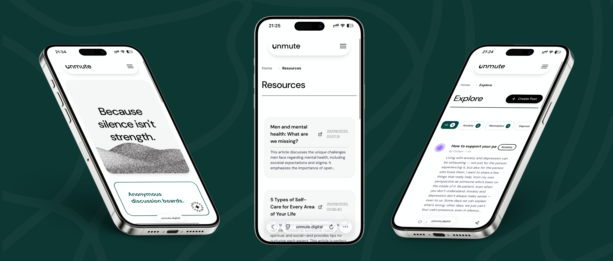

# unMute - Breaking the Silence on Men's Mental Health

<div align="center">


A safe, judgment-free platform where men can share their stories, connect anonymously, journal their experiences, and access mental health resources.

[](https://www.unmute.digital)
[](LICENSE)

</div>

---

## 📋 Table of Contents

- [About](#about)
- [Features](#features)
- [Tech Stack](#tech-stack)
- [Prerequisites](#prerequisites)
- [Installation](#installation)
- [Configuration](#configuration)
- [Running the Application](#running-the-application)
- [Project Structure](#project-structure)
- [API Documentation](#api-documentation)
- [Database Schema](#database-schema)
- [Deployment](#deployment)
- [Contributing](#contributing)
- [License](#license)

---

## 🎯 About

unMute addresses the stigma surrounding men's mental health by providing:

- **Anonymous Discussion Boards** - Share stories without judgment
- **Private Journaling** - Track moods and thoughts securely
- **Curated Resources** - Access mental health support materials
- **Supportive Community** - Connect with others facing similar challenges

### The Problem
Men face significant barriers in discussing mental health due to societal expectations and stigma. unMute creates a safe space for vulnerability and healing.

### Target Audience
- Men experiencing anxiety, depression, stress, or other mental health challenges
- Those seeking anonymous peer support
- Users wanting private journaling tools with mood tracking
- Anyone looking for curated mental health resources

---

## ✨ Features

### Core Functionality
- ✅ **User Authentication** - JWT-based secure login/registration with bcrypt password hashing
- ✅ **Anonymous Posting** - Share stories publicly while protecting identity
- ✅ **Private Journaling** - Personal entries with mood tracking (excited, happy, indifferent, sad, frustrated)
- ✅ **Mental Health Resources** - Admin-curated support materials and links
- ✅ **Comment System** - Engage with community posts
- ✅ **Like System** - Show support for posts
- ✅ **Content Moderation** - Flag inappropriate content for admin review
- ✅ **Topic Filtering** - Browse posts by category (Joy, Stress, Anxiety, Depression, Motivation, Other)

### Admin Features
- 🛡️ **Flagged Content Management** - Review and moderate reported posts/comments
- 🗑️ **Content Deletion** - Remove inappropriate material
- 👥 **User Management** - View users and manage admin privileges
- 📚 **Resource Management** - Add/remove mental health resources

### Advanced Features
- 🎭 **Anonymous Mode** - Post without revealing username (while logged in)
- 📊 **Mood Check-ins** - Track emotional state with journal entries
- 🔒 **Role-Based Access Control** - Admin vs. regular user permissions
- 📱 **Responsive Design** - Mobile-first UI with Tailwind CSS
- 🎨 **Smooth Animations** - Framer Motion transitions
- 📈 **Google Analytics** - GA4 integration for insights
- 🔍 **SEO Optimized** - Dynamic meta tags, sitemap, structured data
- 🖼️ **Cloudinary CDN** - Optimized image delivery

---

## 🛠️ Tech Stack

### Frontend
- **Framework:** React 19.1.0
- **Build Tool:** Vite 7.0.4
- **Styling:** Tailwind CSS 4.1.11 + DaisyUI 5.1.12
- **Routing:** React Router DOM 7.7.1
- **HTTP Client:** Axios 1.12.2
- **Animations:** Framer Motion 12.23.19
- **Icons:** Lucide React, Heroicons
- **CDN:** Cloudinary for image optimization

### Backend
- **Runtime:** Node.js
- **Framework:** Express 5.1.0
- **Database:** MySQL (Railway)
- **ORM/Driver:** mysql2 3.15.0 with connection pooling
- **Authentication:** jsonwebtoken 9.0.2
- **Password Hashing:** bcrypt 6.0.0
- **Environment:** dotenv 17.2.2
- **CORS:** cors 2.8.5

### DevOps & Tools
- **Hosting:** Heroku (Backend + Frontend)
- **Database:** Railway MySQL
- **Analytics:** Google Analytics 4 (GA4)
- **Version Control:** Git & GitHub
- **Package Manager:** npm

---

## 📦 Prerequisites

Before you begin, ensure you have the following installed:

- **Node.js** (v18.x or higher) - [Download](https://nodejs.org/)
- **npm** (v9.x or higher) - Comes with Node.js
- **MySQL** (v8.x or higher) - [Download](https://dev.mysql.com/downloads/)
- **Git** - [Download](https://git-scm.com/downloads)

Optional but recommended:
- **MySQL Workbench** - For database management
- **Postman** - For API testing
- **VS Code** - Recommended code editor

---

## 🚀 Installation

### 1. Clone the Repository

```bash
git clone https://github.com/wrapperik/unMute_RikusPretorius_241044.git
cd unMute_RikusPretorius_241044
```

### 2. Install Backend Dependencies

```bash
cd backend
npm install
```

### 3. Install Frontend Dependencies

```bash
cd ../Frontend/unMute
npm install
```

---

## ⚙️ Configuration

### 1. Database Setup

#### Option A: Using Railway (Recommended for Production)

1. Create a [Railway](https://railway.app/) account
2. Create a new MySQL database
3. Note your connection details from Railway dashboard

#### Option B: Local MySQL

```bash
# Start MySQL service
# macOS (Homebrew)
brew services start mysql

# Windows
net start MySQL80

# Linux
sudo systemctl start mysql

# Create database
mysql -u root -p
CREATE DATABASE unmute_db;
EXIT;
```

### 2. Backend Environment Variables

Create `backend/.env` file:

```bash
cd backend
cp .env.example .env
```

Edit `backend/.env` with your actual values:

```env
# Node Environment
NODE_ENV=development

# Database Configuration (Railway Example)
DB_HOST=your-railway-host.proxy.rlwy.net
DB_PORT=your-railway-port
DB_USER=root
DB_PASS=your-database-password
DB_NAME=railway
DB_SSL=false

# OR for Local MySQL
# DB_HOST=localhost
# DB_PORT=3306
# DB_USER=root
# DB_PASS=your-mysql-password
# DB_NAME=unmute_db
# DB_SSL=false

# JWT Secret (Generate a strong random string)
JWT_SECRET=your-super-secret-jwt-key-change-this-in-production

# Server Port
PORT=5050
```

**Generate a secure JWT secret:**
```bash
# macOS/Linux
openssl rand -base64 32

# Or use any random string generator
```

### 3. Database Schema

Import the database schema (if you have a SQL dump file):

```bash
# For Railway
mysql -h your-host.proxy.rlwy.net -P your-port -u root -p railway < database_dump.sql

# For Local MySQL
mysql -u root -p unmute_db < database_dump.sql
```

**Or create tables manually** (see [Database Schema](#database-schema) section below)

### 4. Frontend Environment Variables (Optional)

Create `Frontend/unMute/.env` file if needed:

```env
VITE_API_BASE=http://localhost:5050
```

> **Note:** In development, Vite proxy handles API calls. This is only needed for production builds.

---

## 🏃 Running the Application

### Development Mode (Recommended)

#### Terminal 1: Start Backend Server

```bash
cd backend
npm run dev
```

Expected output:
```
✅ MySQL pool ready
📍 Connected to: your-host:port
📊 Database: unmute_db
Server running on port 5050
```

#### Terminal 2: Start Frontend Dev Server

```bash
cd Frontend/unMute
npm run dev
```

Expected output:
```
  VITE v7.0.4  ready in XXX ms

  ➜  Local:   http://localhost:5173/
  ➜  Network: use --host to expose
  ➜  press h + enter to show help
```

#### Access the Application

Open your browser and navigate to:
```
http://localhost:5173
```

The frontend will proxy API requests to `http://localhost:5050` automatically.

### Production Build

#### 1. Build Frontend

```bash
cd Frontend/unMute
npm run build
```

This creates optimized static files in `Frontend/unMute/dist/`

#### 2. Start Production Server

```bash
cd ../../backend
NODE_ENV=production npm start
```

The Express server will serve the built frontend at `http://localhost:5050`

---

## 📁 Project Structure

```
unMute_RikusPretorius_241044/
├── backend/
│   ├── routes/
│   │   ├── admin.js          # Admin management endpoints
│   │   ├── auth.js           # Authentication (login/register)
│   │   ├── journal.js        # Journal entries CRUD
│   │   ├── moodcheckins.js   # Mood tracking
│   │   ├── posts.js          # Public posts, likes, comments
│   │   ├── resources.js      # Mental health resources
│   │   └── user.js           # User profile management
│   ├── .env                  # Environment variables (not in git)
│   ├── .env.example          # Environment template
│   ├── db.js                 # MySQL connection pool
│   ├── server.js             # Express server entry point
│   └── package.json          # Backend dependencies
│
├── Frontend/unMute/
│   ├── public/
│   │   ├── robots.txt        # SEO crawling rules
│   │   ├── sitemap.xml       # SEO sitemap
│   │   └── *.png             # Images and icons
│   ├── src/
│   │   ├── Components/
│   │   │   ├── navbar.jsx
│   │   │   ├── footer.jsx
│   │   │   ├── PostCard.jsx
│   │   │   ├── SEO.jsx       # Dynamic meta tags
│   │   │   └── ...
│   │   ├── context/
│   │   │   └── AuthContext.jsx  # Global auth state
│   │   ├── Pages/
│   │   │   ├── Home.jsx
│   │   │   ├── Explore.jsx   # Browse posts
│   │   │   ├── addPost.jsx   # Create post
│   │   │   ├── addEntry.jsx  # Create journal
│   │   │   ├── Resources.jsx
│   │   │   ├── AdminDashboard.jsx
│   │   │   └── ...
│   │   ├── analytics/
│   │   │   └── gtag.js       # Google Analytics
│   │   ├── App.jsx           # Main app component
│   │   ├── main.jsx          # React entry point
│   │   └── index.css         # Global styles
│   ├── .env.production       # Production env vars
│   ├── index.html            # HTML template
│   ├── vite.config.js        # Vite configuration
│   ├── tailwind.config.js    # Tailwind CSS config
│   └── package.json          # Frontend dependencies
│
├── Procfile                   # Heroku deployment config
├── PRESENTATION_GUIDE.md      # Project presentation outline
└── README.md                  # This file
```

---

## 📡 API Documentation

### Base URL
- **Development:** `http://localhost:5050`
- **Production:** `https://www.unmute.digital`

### Authentication Endpoints

#### POST `/auth/register`
Register a new user.

**Request Body:**
```json
{
  "email": "user@example.com",
  "username": "johndoe",
  "password": "securepassword123"
}
```

**Response:**
```json
{
  "status": "ok",
  "message": "User registered",
  "userId": 1,
  "profilePicture": "pfp3.png"
}
```

#### POST `/auth/login`
Login with email or username.

**Request Body:**
```json
{
  "identifier": "user@example.com",
  "password": "securepassword123"
}
```

**Response:**
```json
{
  "status": "ok",
  "token": "eyJhbGciOiJIUzI1NiIsInR5cCI6IkpXVCJ9...",
  "user": {
    "id": 1,
    "email": "user@example.com",
    "username": "johndoe",
    "is_admin": 0,
    "profilePicture": "pfp3.png"
  }
}
```

### Posts Endpoints

#### GET `/posts/public`
Get all public posts (no auth required).

**Response:**
```json
{
  "status": "ok",
  "data": [
    {
      "post_id": 1,
      "user_id": 1,
      "title": "My Mental Health Journey",
      "topic": "Anxiety",
      "content": "Sharing my story...",
      "is_anonymous": false,
      "username": "johndoe",
      "profile_picture": "pfp3.png",
      "created_at": "2025-11-04T12:00:00Z"
    }
  ]
}
```

#### POST `/posts`
Create a new post (requires authentication).

**Headers:**
```
Authorization: Bearer <token>
```

**Request Body:**
```json
{
  "title": "My Story",
  "topic": "Depression",
  "content": "This is my experience...",
  "is_anonymous": false
}
```

#### POST `/posts/:id/like`
Toggle like on a post (requires authentication).

#### GET `/posts/:id/comments`
Get all comments for a post.

#### POST `/posts/:id/comments`
Add a comment to a post (auth optional for anonymous).

### Journal Endpoints

#### GET `/journal`
Get all journal entries (public listing - consider making user-specific).

#### POST `/journal`
Create a journal entry (requires authentication).

**Request Body:**
```json
{
  "title": "Today's thoughts",
  "content": "Feeling grateful for..."
}
```

#### DELETE `/journal/:id`
Delete a journal entry (owner or admin only).

### Resources Endpoints

#### GET `/resources`
Get all mental health resources (public).

#### POST `/resources`
Add a resource (admin only).

#### DELETE `/resources/:id`
Remove a resource (admin only).

### Admin Endpoints

All admin endpoints require authentication with `is_admin = 1`.

#### GET `/admin/flagged-posts`
Get all flagged posts for review.

#### GET `/admin/flagged-comments`
Get all flagged comments for review.

#### DELETE `/admin/posts/:id`
Delete a post permanently.

#### POST `/admin/posts/:id/unflag`
Remove flag from a post.

---

## 🗄️ Database Schema

### Tables Overview

#### 1. `users`
```sql
CREATE TABLE users (
  user_id INT AUTO_INCREMENT PRIMARY KEY,
  email VARCHAR(255) UNIQUE NOT NULL,
  username VARCHAR(100),
  password VARCHAR(255) NOT NULL,
  is_admin TINYINT DEFAULT 0,
  profile_picture VARCHAR(255) DEFAULT 'pfp1.png',
  created_at TIMESTAMP DEFAULT CURRENT_TIMESTAMP
);
```

#### 2. `PublicPosts`
```sql
CREATE TABLE PublicPosts (
  post_id INT AUTO_INCREMENT PRIMARY KEY,
  user_id INT NOT NULL,
  title VARCHAR(255) NOT NULL,
  topic VARCHAR(100),
  content TEXT NOT NULL,
  is_anonymous TINYINT DEFAULT 0,
  is_flagged TINYINT DEFAULT 0,
  flagged_at TIMESTAMP NULL,
  created_at TIMESTAMP DEFAULT CURRENT_TIMESTAMP,
  FOREIGN KEY (user_id) REFERENCES users(user_id)
);
```

#### 3. `JournalEntries`
```sql
CREATE TABLE JournalEntries (
  entry_id INT AUTO_INCREMENT PRIMARY KEY,
  user_id INT NOT NULL,
  title VARCHAR(255),
  content TEXT NOT NULL,
  created_at TIMESTAMP DEFAULT CURRENT_TIMESTAMP,
  FOREIGN KEY (user_id) REFERENCES users(user_id)
);
```

#### 4. `MoodCheckIns`
```sql
CREATE TABLE MoodCheckIns (
  checkin_id INT AUTO_INCREMENT PRIMARY KEY,
  user_id INT NOT NULL,
  entry_id INT NOT NULL,
  mood VARCHAR(50) NOT NULL,
  created_at TIMESTAMP DEFAULT CURRENT_TIMESTAMP,
  FOREIGN KEY (user_id) REFERENCES users(user_id),
  FOREIGN KEY (entry_id) REFERENCES JournalEntries(entry_id)
);
```

#### 5. `Resources`
```sql
CREATE TABLE Resources (
  resource_id INT AUTO_INCREMENT PRIMARY KEY,
  title VARCHAR(255) NOT NULL,
  url VARCHAR(500),
  description TEXT,
  created_at TIMESTAMP DEFAULT CURRENT_TIMESTAMP
);
```

#### 6. `PostLikes`
```sql
CREATE TABLE PostLikes (
  post_id INT NOT NULL,
  user_id INT NOT NULL,
  created_at TIMESTAMP DEFAULT CURRENT_TIMESTAMP,
  PRIMARY KEY (post_id, user_id),
  FOREIGN KEY (post_id) REFERENCES PublicPosts(post_id),
  FOREIGN KEY (user_id) REFERENCES users(user_id)
);
```

#### 7. `comments`
```sql
CREATE TABLE comments (
  comment_id INT AUTO_INCREMENT PRIMARY KEY,
  post_id INT NOT NULL,
  user_id INT,
  content TEXT NOT NULL,
  is_flagged TINYINT DEFAULT 0,
  flagged_at TIMESTAMP NULL,
  created_at TIMESTAMP DEFAULT CURRENT_TIMESTAMP,
  FOREIGN KEY (post_id) REFERENCES PublicPosts(post_id),
  FOREIGN KEY (user_id) REFERENCES users(user_id)
);
```

---

## 🚀 Deployment

### Heroku Deployment

#### 1. Prerequisites
- Heroku account
- Heroku CLI installed
- Git repository

#### 2. Create Heroku App

```bash
heroku login
heroku create unmute
```

#### 3. Set Environment Variables

```bash
heroku config:set NODE_ENV=production --app unmute
heroku config:set DB_HOST=your-railway-host --app unmute
heroku config:set DB_PORT=your-port --app unmute
heroku config:set DB_USER=root --app unmute
heroku config:set DB_PASS=your-password --app unmute
heroku config:set DB_NAME=railway --app unmute
heroku config:set DB_SSL=false --app unmute
heroku config:set JWT_SECRET=$(openssl rand -base64 32) --app unmute
```

#### 4. Deploy

```bash
git add .
git commit -m "Deploy to Heroku"
git push heroku main
```

#### 5. Verify Deployment

```bash
heroku logs --tail --app unmute
heroku open --app unmute
```

### Railway Database Backup

```bash
# Backup database
mysqldump -h your-host.proxy.rlwy.net -P your-port -u root -p railway > backup.sql

# Restore database
mysql -h your-host.proxy.rlwy.net -P your-port -u root -p railway < backup.sql
```

---

## 🧪 Testing

### Manual Testing Checklist

- [ ] User registration works
- [ ] User login works
- [ ] Create public post (anonymous and named)
- [ ] Like/unlike posts
- [ ] Comment on posts
- [ ] Create journal entry with mood
- [ ] View journal entries
- [ ] Delete journal entry
- [ ] Browse resources
- [ ] Admin: Flag content
- [ ] Admin: Delete flagged content
- [ ] Admin: Add/remove resources

### API Testing with cURL

```bash
# Register user
curl -X POST http://localhost:5050/auth/register \
  -H "Content-Type: application/json" \
  -d '{"email":"test@test.com","password":"test123"}'

# Login
curl -X POST http://localhost:5050/auth/login \
  -H "Content-Type: application/json" \
  -d '{"identifier":"test@test.com","password":"test123"}'

# Get posts
curl http://localhost:5050/posts/public
```

---

## 🤝 Contributing

Contributions are welcome! Please follow these steps:

1. Fork the repository
2. Create a feature branch (`git checkout -b feature/AmazingFeature`)
3. Commit your changes (`git commit -m 'Add some AmazingFeature'`)
4. Push to the branch (`git push origin feature/AmazingFeature`)
5. Open a Pull Request

### Code Style Guidelines
- Use ESLint configuration provided
- Follow React best practices
- Write descriptive commit messages
- Comment complex logic
- Use prepared statements for all SQL queries

---

## 🐛 Troubleshooting

### Common Issues

#### Backend won't start
```bash
# Check if port 5050 is already in use
lsof -i :5050
# Kill the process if needed
kill -9 <PID>
```

#### Database connection fails
- Verify `.env` credentials are correct
- Check if database server is running
- For Railway: Ensure public network access is enabled
- Test connection: `mysql -h HOST -P PORT -u USER -p`

#### Frontend can't reach backend
- Ensure backend is running on port 5050
- Check Vite proxy configuration in `vite.config.js`
- Clear browser cache and reload

#### Images not loading
- Check Cloudinary URLs are correct
- Verify image paths in `public/` folder
- Check browser console for 404 errors

---

## 📄 License

This project is licensed under the MIT License - see the [LICENSE](LICENSE) file for details.

---

## 👤 Author

**Rikus Pretorius**
- Student ID: 241044
- GitHub: [@wrapperik](https://github.com/wrapperik)
- Project: DV200 Summative Assessment

---

## 🙏 Acknowledgments

- Mental health resources from various organizations
- Open source community for amazing tools and libraries
- Tailwind CSS and DaisyUI for beautiful UI components
- Cloudinary for image CDN services
- Railway for database hosting
- Tsungai Katsuro (My amazing lecturer)

---

## 📱 Mockups

<div align="center">



</div>

---
<div align="center">

**Built with ❤️ to support men's mental health**

[Live Demo](https://www.unmute.digital) • [Report Bug](https://github.com/wrapperik/unMute_RikusPretorius_241044/issues) • [Request Feature](https://github.com/wrapperik/unMute_RikusPretorius_241044/issues)

</div>
